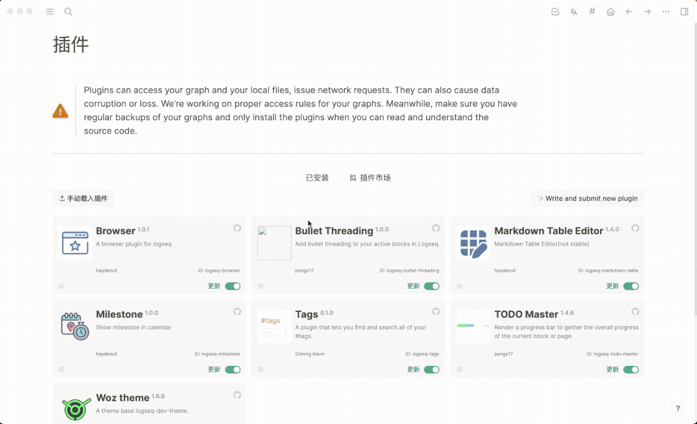

# logseq-plugin-browser
> 支持打开网页的 logseq 插件

[English](./README.md) | 简体中文

## 示例


## 使用方法
1. 安装插件
2. 填写插件配置
3. 点击「重载」插件

## 插件配置

buttons: 显示在顶部的按钮
  - key: 按钮的唯一标识
  - icon: 按钮的图标
  - href: 网页地址
  - style: 网页容器 iframe 的样式

使用[tablericons](https://tablericons.com/)图标库

例如 book 图标, icon 参数值为 `ti-book`

## 配置示例

```json
{
  "buttons": [
    {
      "key": "dida",
      "icon": "ti-checkbox",
      "href": "https://dida365.com/webapp/#q/all/today"
    },
    {
      "key": "translate",
      "icon": "ti-language",
      "href": "https://translate.google.com",
      "style": {
        "width": "400px",
        "right": "20px",
        "top": "50px",
        "left": "auto",
        "bottom": "auto"
      }
    }
  ]
}
```