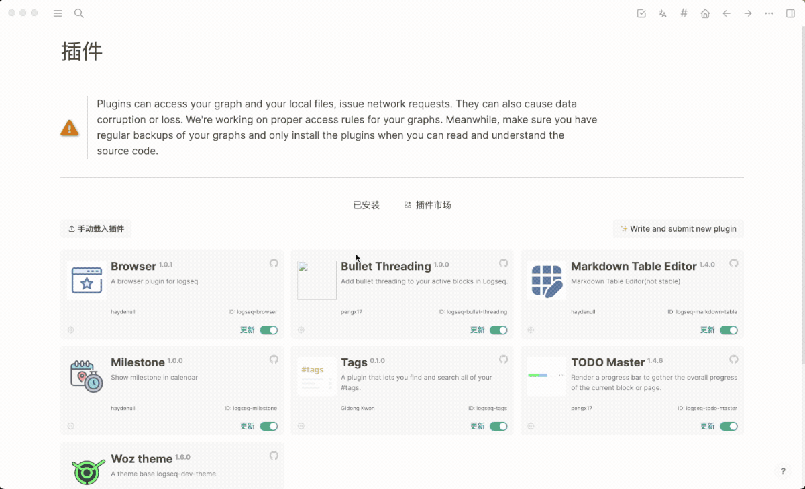

# logseq-plugin-browser
> A browser plugin for logseq

[](https://github.com/haydenull/logseq-plugin-browser/releases)
[](https://github.com/haydenull/logseq-plugin-markdown-table/blob/main/LICENSE)

English | [简体中文](./README-zh_CN.md)

## Demo


## Usage
1. Install plugin
2. Fill in plugin configuration
3. Restart Logseq

## Plugin Configuration

buttons: toolbar buttons
  - key: unique identifier
  - icon: Button icon
  - href: Web page address
  - style: Web page container iframe style

use [tablericons](https://tablericons.com/) icon library

example: book icon, icon parameter value is `ti-book`

## Configuration Example
```json
{
  "buttons": [
    {
      "key": "dida",
      "icon": "ti-checkbox",
      "href": "https://dida365.com/webapp/#q/all/today"
    },
    {
      "key": "translate",
      "icon": "ti-language",
      "href": "https://translate.google.com",
      "style": {
        "width": "400px",
        "right": "20px",
        "top": "50px",
        "left": "auto",
        "bottom": "auto"
      }
    }
  ]
}
```
